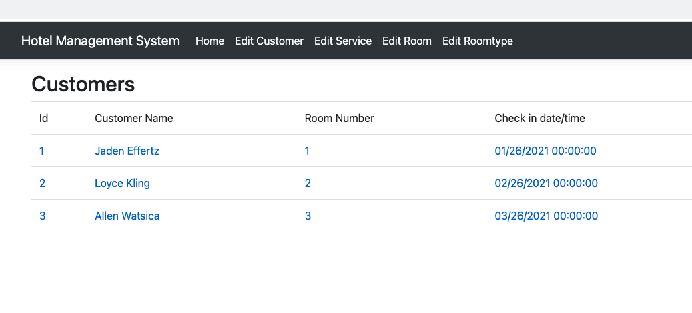

# Rufeng Ma's Final project: Hotel Management System
This is a Hotel Management System
-- Development system: macOS

-- Front end: MVC

-- Backend: .Net 5

<h3>Before Run this project in VS,some suggestions</h3>

1. If you are on a Windows system, please go to <b>appsetting.json</b> to change the Connection String to your server IP.

2. Run sql server

3. Migration once.

macOS==>

-- Make sure your Azure and SQL server are running.

-- terminal: cd HotelManagement.MVC 

-- terminal: dotnet ef migrations add initialTables --project ../Infrastructure/Infrastructure.csproj

-- VS: check <b>migration</b> file

-- terminal: dotnet ef database update

4.Run the <b>inserteData.sql, the data come from MovieShop project</b> file in your Azure Data Studio or sql server management studio (SSMS).

<h3>Schema</h3>

<h3>Homepage</h3>

<h3>Example Of Add/Delete/Update/Search</h3>

<h3>Customer Detail Page</h3>

